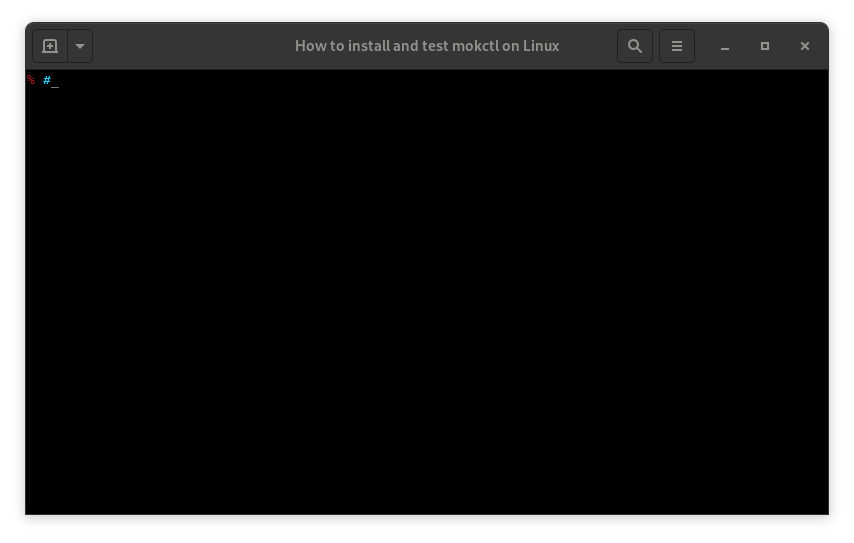

# Install mokctl on Linux



View the [screencast file](../cmdline-player/install-mokctl-linux.scr)

```bash
# How to install and use mokctl
lsb_release -d
git clone https://github.com/mclarkson/my-own-kind.git
cd my-own-kind
sudo make test # <- yes, sudo is required to test :(
sudo make install
# The base image used for 'nodes' needs to be built first:
mokctl build
# Use 'sudo mokctl' to run podman as root (required) or set an alias as shown above:
alias mokctl="sudo mokctl"
mokctl build -h
mokctl build image
^c
# I hit Control-C there
# Building an image locally will take a good few minutes.
# Let's download it from a container registry instead:
mokctl build image --get-prebuilt-image
mokctl create -h
# Let's create a single node kubernetes cluster, this will take a few minutes...
mokctl create cluster myk8s 1 0
export KUBECONFIG=/var/tmp/admin.conf
kubectl get pods -A
for i in {10..1}; do echo -n "$i.."; sleep 1; done; echo
kubectl get pods -A
for i in {10..1}; do echo -n "$i.."; sleep 1; done; echo
kubectl get pods -A
# Kubernetes looks about ready :)
# Let's try starting a Pod:
kubectl run --rm -ti --restart=Never --image=alpine shell2 sh
ip address
apk add fortune
# 'apk add' downloads from the Internet, so networking and external dns looks ok
fortune
exit
mokctl get cluster
# Now to delete the cluster we just made:
mokctl delete cluster myk8s
y
mokctl get cluster
# And uninstall mokctl
sudo make uninstall
cd ..
rm -rf my-own-kind
# That's it for now...
# Thanks for watching!
```
