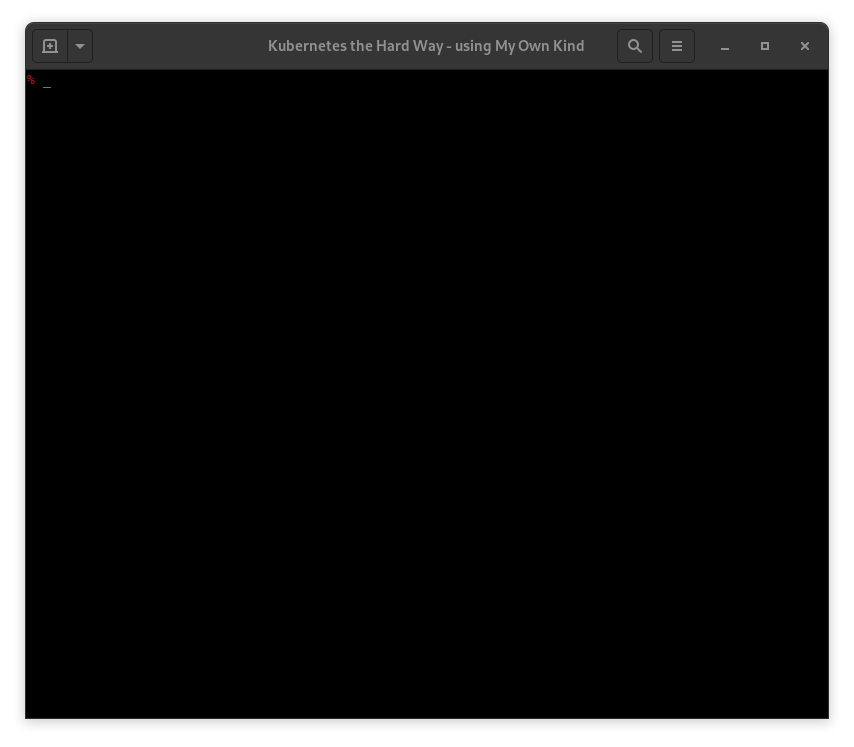

# KTHW 02 Client Tools



View the [screencast file](../cmdline-player/kthw-2.scr)

```bash
.MD >  **Kubernetes the Hard Way using My Own Kind**
.MD > 
.MD > View a [screencast and transcript](/cmdline-player/kthw-2.md)
.MD 
.MD # Installing the Client Tools
.MD 
.MD In this lab you will install the command line utilities required to complete this tutorial: [cfssl](https://github.com/cloudflare/cfssl), [cfssljson](https://github.com/cloudflare/cfssl), and [kubectl](https://kubernetes.io/docs/tasks/tools/install-kubectl).
.MD 
.MD ## Install CFSSL
.MD 
.MD The `cfssl` and `cfssljson` command line utilities will be used to provision a [PKI Infrastructure](https://en.wikipedia.org/wiki/Public_key_infrastructure) and generate TLS certificates.
.MD 
.MD Download and install `cfssl` and `cfssljson`:
# ---------------------------------------------------------
# Kubernetes the Hard Way - using `mokctl` from My Own Kind
# ---------------------------------------------------------
# 02-client-tools
# Install CFSSL

# Let's do all this in a container so the host is kept clean
# We'll start a container with podman and create a new
# directory to use as a volume mount, where we'll put
# all the certificates.

.MD 
.MD ### Linux
.MD 
.MD Create a machine to do our work in and install wget:
.MD
.MD ```
podman ps
mkdir -p kthw-certs
podman run -d -v $PWD/kthw-certs:/certs --name kthw fedora /sbin/init
podman exec -ti kthw bash
cd
dnf -y install wget
.MD ```
.MD
.MD Install the client tools:
.MD
.MD ```
# Installing the Client Tools
wget -q --show-progress --https-only --timestamping \
  https://storage.googleapis.com/kubernetes-the-hard-way/cfssl/linux/cfssl \
  https://storage.googleapis.com/kubernetes-the-hard-way/cfssl/linux/cfssljson
.MD ```
.MD
.MD ```
chmod +x cfssl cfssljson
.MD ```
.MD
.MD ```
sudo mv cfssl cfssljson /usr/local/bin/
.MD ```
.MD
.MD ### Verification
.MD
.MD Verify `cfssl` and `cfssljson` version 1.3.4 or higher is installed:
.MD
.MD ```
# Verification
cfssl version
.MD ```
.MD
.MD ```
cfssljson --version
.MD ```
.MD
.MD ## Install kubectl
.MD
.MD ### Linux
# Install kubectl
# Linux
.MD
.MD ```
wget https://storage.googleapis.com/kubernetes-release/release/v1.15.3/bin/linux/amd64/kubectl
.MD ```
.MD
.MD ```
chmod +x kubectl
.MD ```
.MD
.MD ```
sudo mv kubectl /usr/local/bin/
.MD ```
.MD
.MD ### Verification
.MD
.MD ```
# Verification
kubectl version --client
.MD ```
.MD
.MD Then exit from our Pod
.MD
.MD ```
exit
.MD ```
# ------------------------------------
# Next: Provisioning Compute Resources
# ------------------------------------
.MD
.MD Next: [Provisioning Compute Resources](03-compute-resources.md)
```
