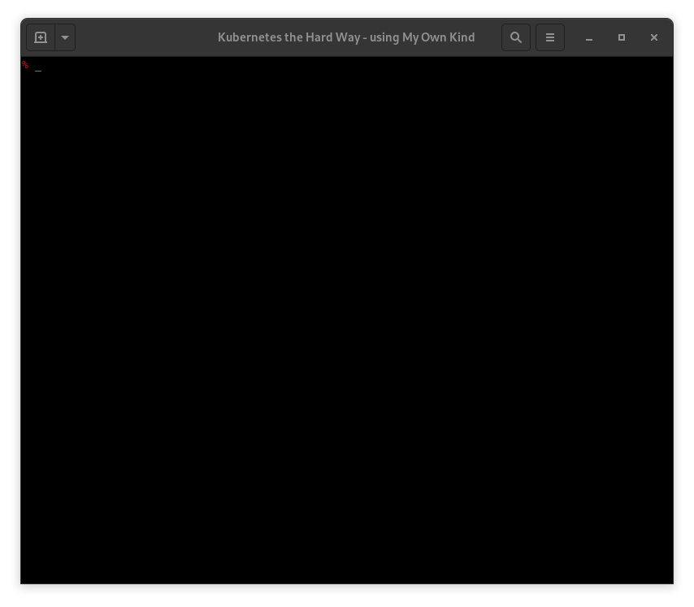

> **My Own Kind changes:**
> 
> * Changed node names
> * Changed commands from `gcloud` to `docker`
> 
> 
> 
> [Screencast transcript](/cmdline-player/kthw-5.md)

# Generating Kubernetes Configuration Files for Authentication

In this lab you will generate [Kubernetes configuration files](https://kubernetes.io/docs/concepts/configuration/organize-cluster-access-kubeconfig/), also known as kubeconfigs, which enable Kubernetes clients to locate and authenticate to the Kubernetes API Servers.

## Client Authentication Configs

In this section you will generate kubeconfig files for the `controller manager`, `kubelet`, `kube-proxy`, and `scheduler` clients and the `admin` user.

### Kubernetes Public IP Address

Each kubeconfig requires a Kubernetes API Server to connect to. To support high availability the IP address assigned to the external load balancer fronting the Kubernetes API Servers will be used.

Retrieve the `kubernetes-the-hard-way` static IP address:

```
KUBERNETES_PUBLIC_ADDRESS=$(grep kthw-lb /certs/cluster-list.txt | awk '{ print $NF; }')
```

### The kubelet Kubernetes Configuration File

When generating kubeconfig files for Kubelets the client certificate matching the Kubelet's node name must be used. This will ensure Kubelets are properly authorized by the Kubernetes [Node Authorizer](https://kubernetes.io/docs/admin/authorization/node/).

> The following commands must be run in the same directory used to generate the SSL certificates during the [Generating TLS Certificates](04-certificate-authority.md) lab.

Generate a kubeconfig file for each worker node:

```
for instance in kthw-worker-1 kthw-worker-2 kthw-worker-3; do
  kubectl config set-cluster kubernetes-the-hard-way \
    --certificate-authority=ca.pem \
    --embed-certs=true \
    --server=https://${KUBERNETES_PUBLIC_ADDRESS}:6443 \
    --kubeconfig=${instance}.kubeconfig

  kubectl config set-credentials system:node:${instance} \
    --client-certificate=${instance}.pem \
    --client-key=${instance}-key.pem \
    --embed-certs=true \
    --kubeconfig=${instance}.kubeconfig

  kubectl config set-context default \
    --cluster=kubernetes-the-hard-way \
    --user=system:node:${instance} \
    --kubeconfig=${instance}.kubeconfig

  kubectl config use-context default --kubeconfig=${instance}.kubeconfig
done
```

Results:

```
worker-1.kubeconfig
worker-2.kubeconfig
worker-3.kubeconfig
```

### The kube-proxy Kubernetes Configuration File

Generate a kubeconfig file for the `kube-proxy` service:

```
{
  kubectl config set-cluster kubernetes-the-hard-way \
    --certificate-authority=ca.pem \
    --embed-certs=true \
    --server=https://${KUBERNETES_PUBLIC_ADDRESS}:6443 \
    --kubeconfig=kube-proxy.kubeconfig

  kubectl config set-credentials system:kube-proxy \
    --client-certificate=kube-proxy.pem \
    --client-key=kube-proxy-key.pem \
    --embed-certs=true \
    --kubeconfig=kube-proxy.kubeconfig

  kubectl config set-context default \
    --cluster=kubernetes-the-hard-way \
    --user=system:kube-proxy \
    --kubeconfig=kube-proxy.kubeconfig

  kubectl config use-context default --kubeconfig=kube-proxy.kubeconfig
}
```

Results:

```
kube-proxy.kubeconfig
```

### The kube-controller-manager Kubernetes Configuration File

Generate a kubeconfig file for the `kube-controller-manager` service:

```
{
  kubectl config set-cluster kubernetes-the-hard-way \
    --certificate-authority=ca.pem \
    --embed-certs=true \
    --server=https://127.0.0.1:6443 \
    --kubeconfig=kube-controller-manager.kubeconfig

  kubectl config set-credentials system:kube-controller-manager \
    --client-certificate=kube-controller-manager.pem \
    --client-key=kube-controller-manager-key.pem \
    --embed-certs=true \
    --kubeconfig=kube-controller-manager.kubeconfig

  kubectl config set-context default \
    --cluster=kubernetes-the-hard-way \
    --user=system:kube-controller-manager \
    --kubeconfig=kube-controller-manager.kubeconfig

  kubectl config use-context default --kubeconfig=kube-controller-manager.kubeconfig
}
```

Results:

```
kube-controller-manager.kubeconfig
```

### The kube-scheduler Kubernetes Configuration File

Generate a kubeconfig file for the `kube-scheduler` service:

```
{
  kubectl config set-cluster kubernetes-the-hard-way \
    --certificate-authority=ca.pem \
    --embed-certs=true \
    --server=https://127.0.0.1:6443 \
    --kubeconfig=kube-scheduler.kubeconfig

  kubectl config set-credentials system:kube-scheduler \
    --client-certificate=kube-scheduler.pem \
    --client-key=kube-scheduler-key.pem \
    --embed-certs=true \
    --kubeconfig=kube-scheduler.kubeconfig

  kubectl config set-context default \
    --cluster=kubernetes-the-hard-way \
    --user=system:kube-scheduler \
    --kubeconfig=kube-scheduler.kubeconfig

  kubectl config use-context default --kubeconfig=kube-scheduler.kubeconfig
}
```

Results:

```
kube-scheduler.kubeconfig
```

### The admin Kubernetes Configuration File

Generate a kubeconfig file for the `admin` user:

```
{
  kubectl config set-cluster kubernetes-the-hard-way \
    --certificate-authority=ca.pem \
    --embed-certs=true \
    --server=https://127.0.0.1:6443 \
    --kubeconfig=admin.kubeconfig

  kubectl config set-credentials admin \
    --client-certificate=admin.pem \
    --client-key=admin-key.pem \
    --embed-certs=true \
    --kubeconfig=admin.kubeconfig

  kubectl config set-context default \
    --cluster=kubernetes-the-hard-way \
    --user=admin \
    --kubeconfig=admin.kubeconfig

  kubectl config use-context default --kubeconfig=admin.kubeconfig
}
```

Results:

```
admin.kubeconfig
```

## Distribute the Kubernetes Configuration Files

Copy the appropriate `kubelet` and `kube-proxy` kubeconfig files to each worker instance:

```
for instance in kthw-worker-1 kthw-worker-2 kthw-worker-3; do
  docker cp ${instance}.kubeconfig ${instance}:/root
  docker cp kube-proxy.kubeconfig ${instance}:/root
done
```

Copy the appropriate `kube-controller-manager` and `kube-scheduler` kubeconfig files to each controller instance:

```
for instance in kthw-master-1 kthw-master-2 kthw-master-3; do
  docker cp admin.kubeconfig ${instance}:/root
  docker cp kube-controller-manager.kubeconfig ${instance}:/root
  docker cp kube-scheduler.kubeconfig ${instance}:/root
done
```

Next: [Generating the Data Encryption Config and Key](06-data-encryption-keys.md)
